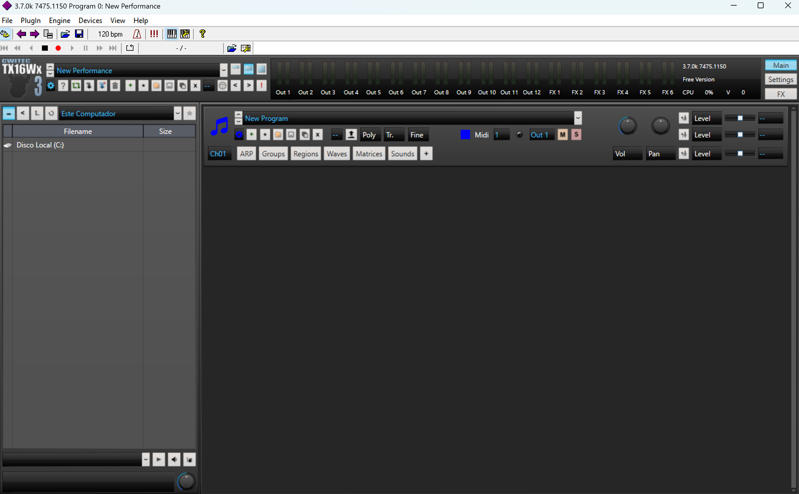
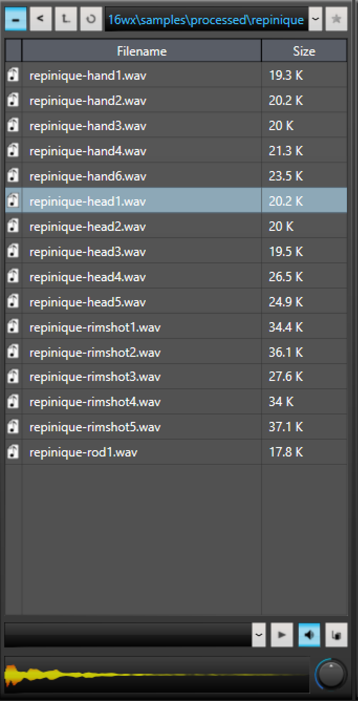
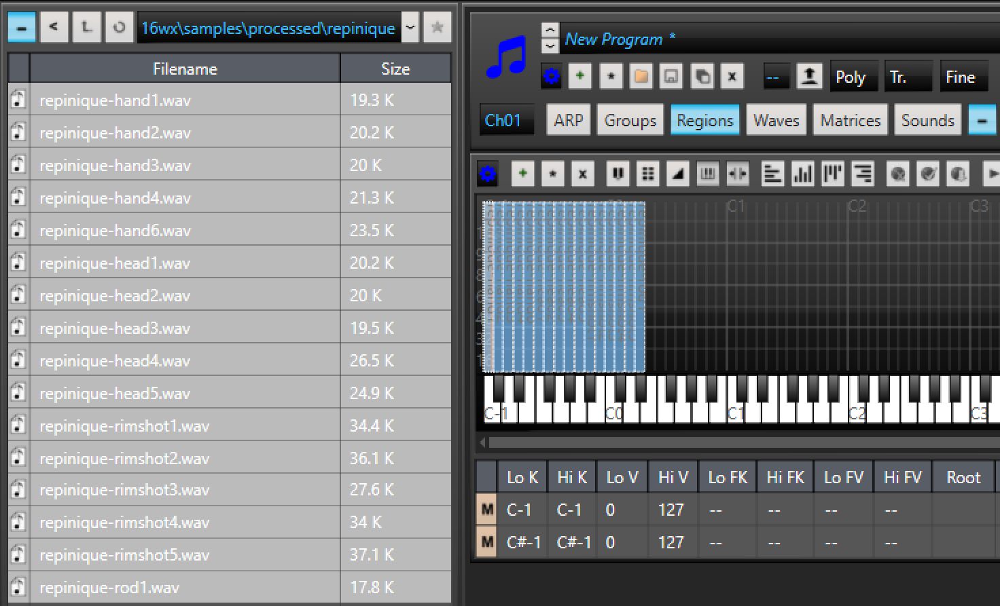
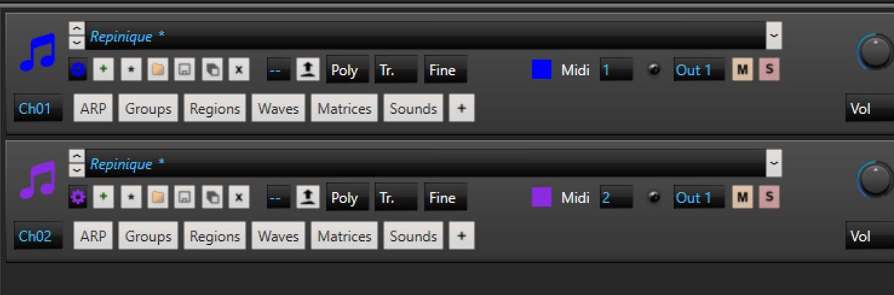
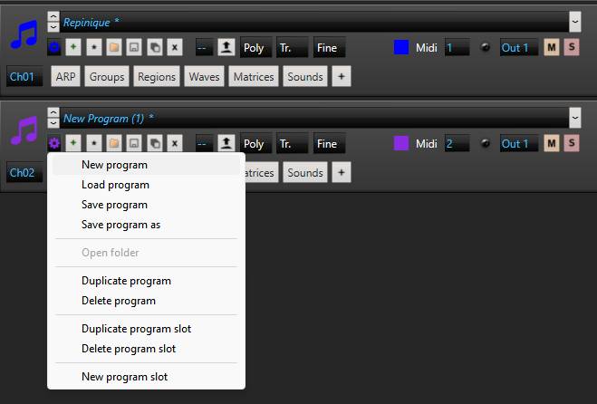
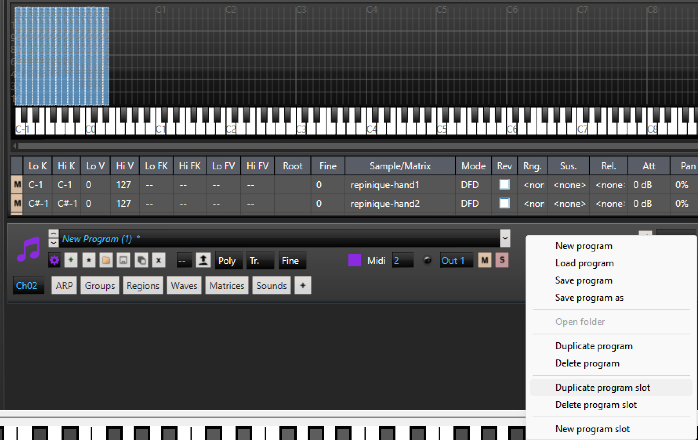
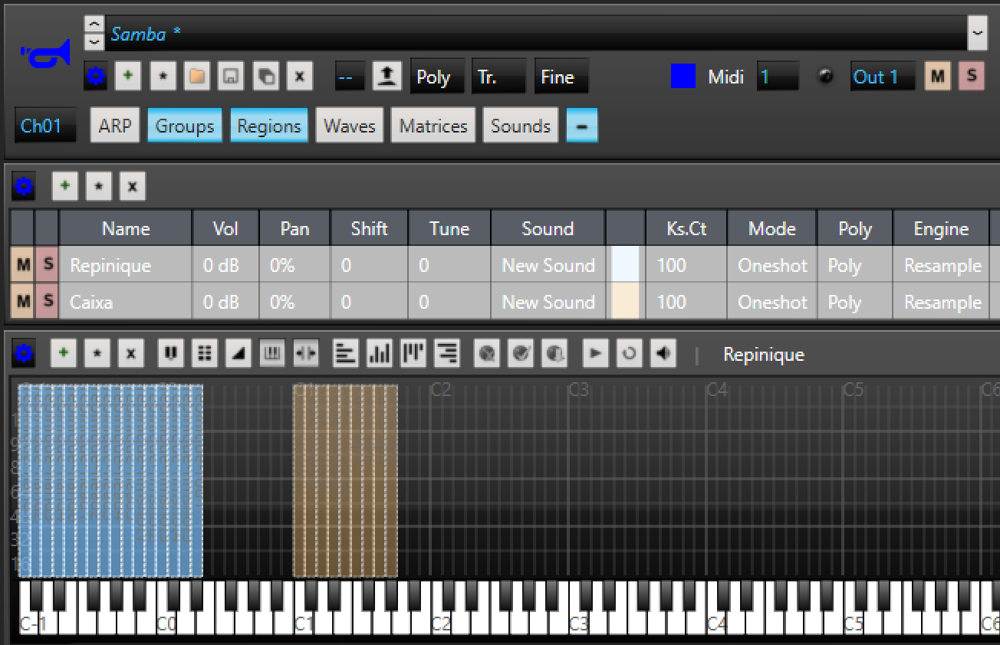
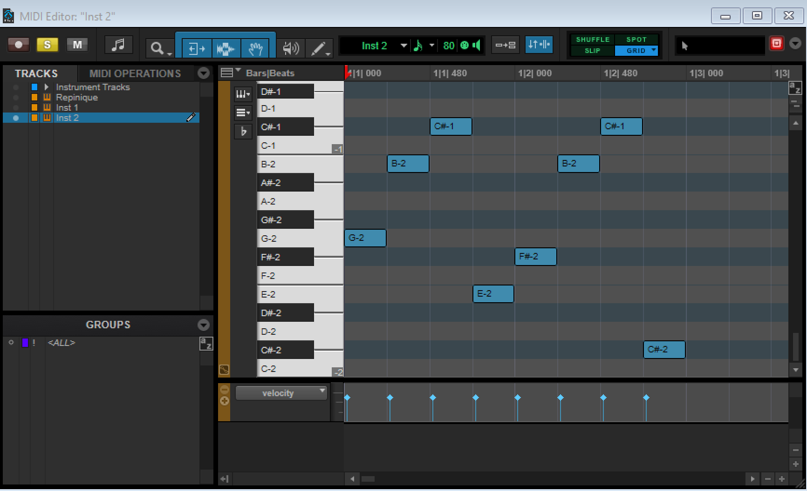

# TX16Wx

## To com pressa: Como usar o template

Para usar o plugin:

- Baixe e instale o [Reaper](https://www.reaper.fm/download.php).
- Baixe e instale o [TX16Wx](https://www.tx16wx.com/download/).
- Baixe [este repositório](https://github.com/brunomariz/tx16wx/archive/refs/heads/main.zip).
- Descompacte o repositório.
- Abra `examples/template.rpp` no Reaper.
- Clique nos items MIDI para fazer alterações.
- Mais instruções de como usar o Reaper: https://www.reaper.fm/videos.php

## To sem pressa: Criando um instrumento de samba do zero

### Obtendo samples

- Pegue as samples em [https://freesound.org/](https://freesound.org/) ou onde preferir e corte-as em arquivos WAV individuais (o Audacity é uma boa opção).
- O Audacity também permite gravar o som do seu próprio PC (loopback), então se você estiver com um vídeo ou áudio tocando, pode abrir o Audacity e fazer o seguinte:
  - Clique em *Configuração de Áudio* (Audio Setup)
  - Defina *Host* como **WASAPI**
  - Defina o *Dispositivo de Gravação* como **Fones de ouvido (loopback)** ou **Caixas de Som Realtek (loopback)**
  - Crie uma faixa *stereo* e clique em gravar

### Usando as samples no sampler MIDI

- Baixe o TX16Wx. [Ele não funciona de forma independente](https://www.tx16wx.com/f-a-q/), então também baixe o [SAVIHost](https://www.hermannseib.com/english/savihost.htm). Usei a versão VST2 com teclado.
- Quando você executar o arquivo do savihost, ele abrirá uma janela do explorador. Encontre o plugin TX16Wx instalado. No meu caso, está em `C:\Program Files\Steinberg\VSTPlugins\TX16Wx.dll`.

Plugin aberto:

- Encontre suas samples no explorador de arquivos. Ative o botão de som abaixo para ouvir os samples ao clicar.

- Abra a aba **Regions** e arraste os samples para lá. Eles serão mapeados para teclas MIDI.

- Na aba **Groups**, altere o modo para **Oneshot** para que o som toque inteiro ao pressionar a tecla MIDI, ao invés de cortar de acordo com a duração da nota.

- Na aba **Groups**, é possível definir o modo de polifonia. `Poly` é o modo padrão, que faz com que cada tecla toque uma nova voz. O modo `Mono` faz com que ao tocar uma tecla o último som pare, como em instrumentos monofônicos. Isso pode ser usado para evitar sobreposição de notas em uma única boca do agogô, por exemplo, colocando os sons de cada boca em um grupo separado (mais realista e mais trabalho), ou simplesmente deixando todo o agogô monofônico (opção menos realista, menos trabalho). Segundo [o manual do TX16Wx](https://www.tx16wx.com/download/), modo `Legato` serve para bends.
- A aba **Waves** pode ser usada para cortar os samples, mas usamos o Audacity para isso.

- Para adicionar mais instrumentos, clique com o botão direito em uma área vazia do plugin e selecione **New Slot**.
- O novo slot pode estar usando o mesmo programa que você acabou de criar. Nesse caso, clique no ícone de engrenagem e selecione **New Program**.

Programa duplicado:

Novo programa:

- Para excluir um programa ou slot, clique com o botão direito e escolha a opção desejada. Note que excluir o slot remove apenas o slot, mas o programa pode ser reaberto a partir de um novo slot selecionando-o no menu de nome do programa.

- Também é possível adicionar todos os sons em um único programa e criar diferentes grupos para organização ou aplicação de regras distintas.

### Exportando o programa

- Quando terminar de adicionar os sons ao instrumento, você pode exportar o programa em `Plugin > Save Program`. Se usou múltiplos programas, exporte o banco completo em `Plugin > Save Bank`. Certifique-se de escolher uma pasta, pois isso pode gerar vários arquivos.

## Importando o instrumento na DAW

- Agora que você tem o programa ou banco criado, abra sua DAW (Pro Tools Intro e [Reaper](https://www.reaper.fm/download.php) são boas opções gratuitas).
- Na DAW, crie uma faixa de instrumento *stereo* e insira o TX16Wx como plugin. No Pro Tools, pressione `Ctrl+Shift+N`, crie a faixa de instrumento e adicione o plugin como insert.
- Clique em **Load Program** e selecione o programa que você criou.
- Abra o editor MIDI da faixa e adicione as notas correspondentes aos sons.

Certifique-se de que seu teclado MIDI ou item MIDI esteja enviando para o canal correto (geralmente canal 1 por padrão).

> **Nota:** os números das oitavas na DAW podem não coincidir com os do plugin TX16Wx.

### Reaper

- Pressione `Ctrl+T` para criar uma nova faixa, e clique no botão **FX** na faixa para buscar pelo plugin TX16Wx.

- Certifique-se de que o `.dll` (VST2 ou VST3) está em uma pasta que o Reaper escaneia para plugins.

- Pastas comuns de plugins VST:

  - `C:\Program Files\VSTPlugins`
  - `C:\Program Files\Common Files\VST3`
  - `C:\Program Files\Steinberg\VSTPlugins`

- Se o TX16Wx for um `.dll` na pasta "Steinberg", o Reaper pode usá-lo — apenas aponte o Reaper para essa pasta (provavelmente já está, por padrão).

- Defina a entrada da faixa para **MIDI (todos os canais)**

- Desenhe ou grave notas MIDI que correspondam às zonas mapeadas no TX16Wx.
